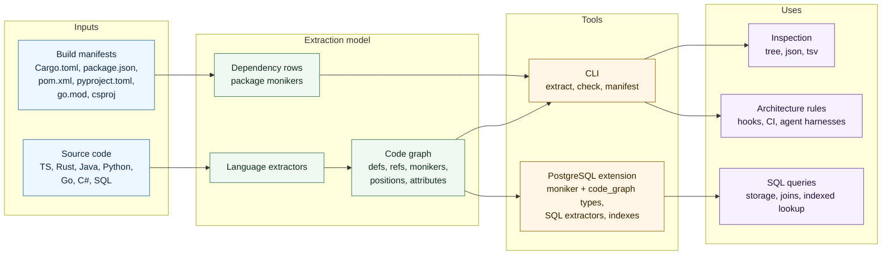

<p align="center">
  <picture>
    <source media="(prefers-color-scheme: dark)" srcset="docs/logo-dark.svg">
    
  </picture>
</p>

# code-moniker

[](https://github.com/ng-galien/code-moniker/actions/workflows/ci.yml)
[](https://crates.io/crates/code-moniker)
[](https://crates.io/crates/code-moniker-core)
[](#license)
[](https://www.rust-lang.org)
[](https://github.com/pgcentralfoundation/pgrx)
[](https://www.postgresql.org)

`code-moniker` extracts a symbol graph from source code.

It turns source files into stable symbol identities, then exposes the
same graph through two surfaces:

- a CLI for inspecting code and enforcing architecture rules in hooks or CI;
- a PostgreSQL extension for storing and querying symbol graphs with SQL.

Supported languages: TypeScript / JavaScript / TSX / JSX, Rust, Java,
Python, Go, C#, SQL, and PL/pgSQL.

## At a glance



First useful commands:

```sh
code-moniker extract src/order.ts --format tree
code-moniker ui . --cache .code-moniker-cache
code-moniker check src/ --report
code-moniker manifest .
```

## What it is for

Use `code-moniker` when text search is too weak because the question is
about symbols and relationships:

- Which definitions live under `src/domain/`?
- Does domain code import infrastructure code?
- Which classes implement a port?
- Which refs point at a symbol family, even when the final segment kind
  differs across import and definition sites?
- Can this rule run after every edit, before commit, or in CI?

## How extraction works

The unit of identity is a `moniker`: a URI-like path made of typed
segments. Each segment says what the name means, not only where text was
found.

For this file:

```ts
// src/domain/order.ts
export class OrderEntity {
  total() {
    return computeTotal();
  }
}

function computeTotal() {
  return 42;
}
```

`extract` emits definitions such as:

```text
code+moniker://./lang:ts/dir:src/dir:domain/module:order/class:OrderEntity
code+moniker://./lang:ts/dir:src/dir:domain/module:order/function:computeTotal()
```

It also emits refs between those definitions. The call inside
`OrderEntity.total()` points at the `function:computeTotal()` moniker,
so rules and queries can reason over relationships instead of strings.

Common ref kinds include calls, imports, inheritance, implemented
interfaces, type usage, annotations, and language-specific edges. In
project scans, file paths are anchored relative to the scanned root:
`code-moniker extract src/` sees `src/domain/order.ts` as
`dir:domain/module:order`.

## Install

Install the standalone CLI:

```sh
cargo install code-moniker
```

Or install the latest `main`:

```sh
cargo install --git https://github.com/ng-galien/code-moniker code-moniker
```

From a local checkout:

```sh
cargo install --path crates/cli
```

## First CLI run

Inspect a file:

```sh
code-moniker extract src/order.ts --format tree
```

Inspect a directory:

```sh
code-moniker extract src/
```

Filter by kind or shape:

```sh
code-moniker extract src/ --shape callable
code-moniker extract src/ --kind class,interface
```

Run the linter:

```sh
code-moniker check src/
```

Open the read-only terminal explorer:

```sh
code-moniker ui . --cache .code-moniker-cache
```

Exit codes:

| Code | Meaning |
| ---- | ------- |
| `0`  | no violations |
| `1`  | at least one violation |
| `2`  | usage or configuration error |

## Configure rules

`code-moniker check` loads embedded defaults first. If a
`.code-moniker.toml` file exists, it is merged on top.

```toml
[[refs.where]]
id      = "domain-no-infra"
expr    = "source ~ '**/dir:domain/**' => NOT target ~ '**/dir:infrastructure/**'"
message = "Domain code must not depend on infrastructure."

[[ts.class.where]]
id      = "no-god-class"
expr    = "count(method) <= 20 AND all(method, lines <= 60)"
message = "Class `{name}` exceeds the class budget."

[[ts.interface.where]]
id   = "repository-lives-in-domain"
expr = "name =~ Repository$ => moniker ~ '**/dir:domain/**'"
```

Rules evaluate symbols and refs, not source text. The path pattern must
match the moniker encoding produced by the extractor. Check one file when
in doubt:

```sh
code-moniker extract src/order.ts --format json
```

## PostgreSQL extension

The extension installs native `moniker` and `code_graph` types, extractors,
accessors, and indexes. It owns no application tables.

```sql
CREATE EXTENSION code_moniker;
SET search_path = code_moniker, public;

SELECT extract_typescript(
  'src/util.ts',
  'export class Util { run() { return 1; } }',
  'code+moniker://app'::moniker
);
```

Example indexed query:

```sql
SELECT id
FROM module
WHERE graph_root(graph) <@ 'code+moniker://app/lang:ts/dir:domain'::moniker;
```

Install and usage details live in the PostgreSQL docs.

## Documentation

Start with the page that matches the task:

| Task | Page |
| ---- | ---- |
| Inspect symbols from the CLI | [Extract](docs/cli/extract.md) |
| Lint a repository with rules | [Check](docs/cli/check.md) |
| Write rule expressions | [Rule DSL](docs/cli/check-dsl.md) |
| Wire the linter into hooks or CI | [Agent harness](docs/cli/agent-harness.md) |
| Query graphs in PostgreSQL | [Postgres usage](docs/postgres/usage.md) |
| Look up SQL functions and operators | [Postgres reference](docs/postgres/reference.md) |
| Understand moniker URI syntax | [Moniker URI](docs/design/moniker-uri.md) |
| Read the full model | [Design spec](docs/design/spec.md) |
| Build or contribute | [Contributing](CONTRIBUTING.md) |

Full index: [docs/](docs/README.md).

## Performance

The CLI is designed for hooks and CI. Project scans are parallel; per-file
checks are bounded enough for edit hooks. Measurements and reproduction
commands are in [Performance](docs/perf.md).

## License

Dual-licensed under [MIT](LICENSE-MIT) or [Apache 2.0](LICENSE-APACHE),
at your option. Contributions are accepted under the same terms.
