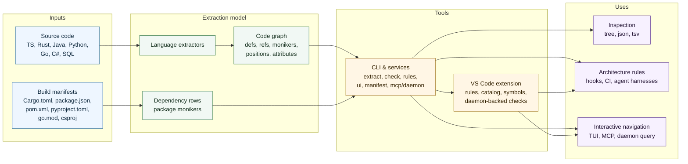

<p align="center">
  <picture>
    <source media="(prefers-color-scheme: dark)" srcset="docs/logo-dark.svg">
    
  </picture>
</p>

# code-moniker

[](https://github.com/ng-galien/code-moniker/actions/workflows/ci.yml)
[](https://crates.io/crates/code-moniker)
[](https://crates.io/crates/code-moniker-core)
[](#license)
[](https://www.rust-lang.org)

`code-moniker` extracts a symbol graph from source code.

It turns source files into stable symbol identities for inspecting code and
enforcing architecture rules in hooks or CI.

Supported languages: TypeScript / JavaScript / TSX / JSX, Rust, Java,
Python, Go, C#, SQL, and PL/pgSQL.

Extractor maturity is uneven by design. `code-moniker` is a fast symbol graph
extractor, not a replacement for each language compiler or type checker.

| Language | Maturity | Honest limit |
| -------- | -------- | ------------ |
| TypeScript / JavaScript | Good | No TypeScript compiler type-checking. |
| Java | Good | No `javac` semantic model. |
| Rust | Good | No macro expansion or rustc name resolution. |
| C# | Usable | No Roslyn semantic model. |
| Python | Usable | Dynamic runtime behaviour is best-effort. |
| Go | Usable | No `go/types` semantic pass. |
| SQL / PLpgSQL | Focused | Narrow dialect and no catalog-aware planner semantics. |
| C | Planned | Not extracted today. |

## At a glance



First useful commands:

```sh
code-moniker extract src/order.ts --format tree
code-moniker rules show .
code-moniker ui . --cache .code-moniker-cache
code-moniker check src/ --report
code-moniker manifest .
```

## What it is for

Use `code-moniker` when text search is too weak because the question is
about symbols and relationships:

- Which definitions live under `src/domain/`?
- Does domain code import infrastructure code?
- Which classes implement a port?
- Which refs point at a symbol family, even when the final segment kind
  differs across import and definition sites?
- Can this rule run after every edit, before commit, or in CI?

## Agentic development

### Challenge

Agentic development needs a stable contract between the repository and
the model. In practice, that contract is usually carried as prose:
`AGENTS.md`, prompt reminders, review comments, architecture notes, or
grep snippets. The agent must read it, keep it in context, and spend
extra turns validating boundaries that the repository could enforce
directly.

That approach breaks down in predictable ways: prompts can be missed,
grep only matches text, and review passes surface violations after the
diff already exists. In modular monorepos, agents may widen their write
scope while trying to be useful. In code bodies, they may leave narrative
comments about micro-decisions, temporary reasoning, or AI-generated
provenance, turning the code itself into noisy context for future
sessions.

### Executable contract

`code-moniker check` encodes that contract as rules over symbols, refs,
paths, and comments. Run it after writes, before commit, or in CI, and a
failure becomes a concrete repair target before the agent treats the task
as done.

| Agent overhead | Executable guardrail |
| -------------- | -------------------- |
| Long prompt rules | keep repository invariants in `.code-moniker.toml` |
| Grep-based sanity checks | evaluate symbol and reference relationships |
| Review agents for known rules | fail fast in the edit hook |
| Repeated inspect-then-fix turns | return concrete violations after each write |
| Unbounded monorepo edits | enforce write scope by module, package, or owner boundary |
| Architecture drift | block forbidden refs, imports, and layer crossings |
| Ownership ambiguity | require symbols to live under the expected path |
| Agent prose in code | reject low-value comments, temporary reasoning traces, or `AI generated` text |

This removes whole sanity-check flows: review agents, grep probes,
repeated prompt instructions, and inspect-then-fix turns. Tokens go to
the actual change instead of revalidating invariants the repository
already knows. The same contract applies to humans, agents, hooks, and
CI.

See [Agent harness](docs/cli/agent-harness.md) for Codex, Claude Code,
and Gemini CLI hooks.

## How extraction works

The unit of identity is a `moniker`: a URI-like path made of typed
segments. Each segment says what the name means, not only where text was
found.

For this file:

```ts
// src/domain/order.ts
export class OrderEntity {
  total() {
    return computeTotal();
  }
}

function computeTotal() {
  return 42;
}
```

`extract` emits definitions such as:

```text
code+moniker://./lang:ts/dir:src/dir:domain/module:order/class:OrderEntity
code+moniker://./lang:ts/dir:src/dir:domain/module:order/function:computeTotal()
```

It also emits refs between those definitions. The call inside
`OrderEntity.total()` points at the `function:computeTotal()` moniker,
so rules and queries can reason over relationships instead of strings.

Common ref kinds include calls, imports, inheritance, implemented
interfaces, type usage, annotations, and language-specific edges. In
project scans, file paths are anchored relative to the scanned root:
`code-moniker extract src/` sees `src/domain/order.ts` as
`dir:domain/module:order`.

## Install

Install the full CLI with the optional interactive surfaces (terminal UI +
MCP server):

```sh
cargo install code-moniker --features tui,mcp
```

Or install the latest `main`:

```sh
cargo install --git https://github.com/ng-galien/code-moniker code-moniker --features tui,mcp
```

From a local checkout:

```sh
cargo install --path crates/cli --features tui,mcp
```

### Features

- `pretty` (default) — colored output.
- `tui` — the `ui` terminal explorer (implies `pretty`).
- `mcp` — the `mcp` server.

Drop `--features tui,mcp` for a lighter core build — `extract`, `check`,
`rules`, … with colored output but no terminal UI or MCP server:

```sh
cargo install code-moniker
```

## VS Code extension

The repository also ships a VS Code extension for day-to-day rule work:
workspace rule files, daemon-backed symbols, check diagnostics, and bundled
`.cm.md` learning scenarios are available from the **Code Moniker** activity
bar.

Install it from this checkout by building the CLI, packaging the extension, and
installing the generated `.vsix`:

```sh
cargo install --path crates/cli --features tui,mcp
cd vscode-extension
npm ci
npm run package
code --install-extension code-moniker-0.1.0.vsix
```

See [VS Code extension](docs/vscode-extension.md) for requirements, settings,
source installation, and development workflow.

## First CLI run

Inspect a file:

```sh
code-moniker extract src/order.ts --format tree
```

Inspect a directory:

```sh
code-moniker extract src/
```

Filter by kind or shape:

```sh
code-moniker extract src/ --shape callable
code-moniker extract src/ --kind class,interface
```

Run the linter:

```sh
code-moniker check src/
```

Open the read-only terminal explorer:

```sh
code-moniker ui . --cache .code-moniker-cache
```

Exit codes:

| Code | Meaning |
| ---- | ------- |
| `0`  | no violations |
| `1`  | at least one violation |
| `2`  | usage or configuration error |

## Configure rules

`code-moniker check` loads embedded defaults first. If a
`.code-moniker.toml` file exists, it is merged on top. Command-line
overlays can add or replace rules for one run without changing the repo:

```sh
code-moniker check src/ --rules-inline '
default_rules = false

[[ts.function.where]]
id      = "no-helper"
expr    = "name != '\''helper'\''"
message = "Pick a function name that describes the behavior."
'
```

The merge order is defaults, project rules, discovered fragments, then each
`--rules-inline` overlay in command-line order. `--default-rules on|off`
still wins over `default_rules` in files or inline TOML.

```toml
[[refs.where]]
id      = "domain-no-infra"
expr    = "source ~ '**/dir:domain/**' => NOT target ~ '**/dir:infrastructure/**'"
message = "Domain code must not depend on infrastructure."

[[ts.class.where]]
id      = "no-god-class"
expr    = "count(method) <= 20 AND all(method, lines <= 60)"
message = "Class `{name}` exceeds the class budget."

[[ts.interface.where]]
id   = "repository-lives-in-domain"
expr = "name =~ Repository$ => moniker ~ '**/dir:domain/**'"
```

Rules evaluate symbols and refs, not source text. The path pattern must
match the moniker encoding produced by the extractor. Check one file when
in doubt:

```sh
code-moniker extract src/order.ts --format json
```

## Documentation

Start with the page that matches the task:

| Task | Page |
| ---- | ---- |
| Inspect symbols from the CLI | [Extract](docs/cli/extract.md) |
| Browse a graph interactively | [UI and MCP](docs/cli/ui.md) |
| Measure extraction coverage and scan time | [Stats](docs/cli/stats.md) |
| List manifest dependencies | [Manifest](docs/cli/manifest.md) |
| Lint a repository with rules | [Check](docs/cli/check.md) |
| Write rule expressions | [Rule DSL](docs/cli/check-dsl.md) |
| Use the VS Code workbench extension | [VS Code extension](docs/vscode-extension.md) |
| Wire checks into agent hooks or CI | [Agent harness](docs/cli/agent-harness.md) |
| Run or query resident workspaces | [Daemon](docs/daemon.md) |
| Understand moniker URI syntax | [Moniker URI](docs/design/moniker-uri.md) |
| Build or contribute | [Contributing](CONTRIBUTING.md) |

Full index: [docs/](docs/README.md).

## Performance

The CLI is designed for hooks and CI. Project scans are parallel; per-file
checks are bounded enough for edit hooks. Measurements and reproduction
commands are in [Performance](docs/perf.md).

## License

Dual-licensed under [MIT](LICENSE-MIT) or [Apache 2.0](LICENSE-APACHE),
at your option. Contributions are accepted under the same terms.
