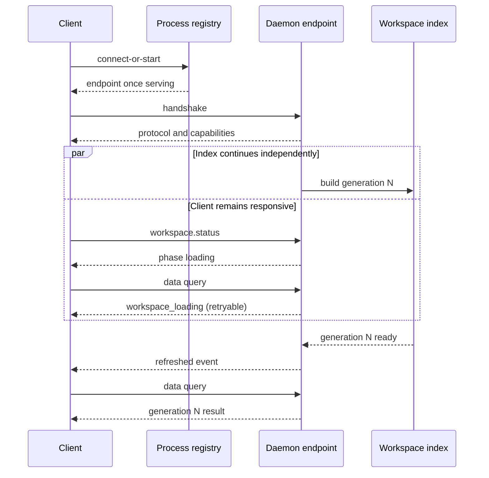

# Map — Rust Workspace (engine, daemon, CLI/MCP)

Operational map for agents working on the Rust side. The bootstrap
(`AGENTS.md`) holds the everyday commands and gates; this map holds the
detail you only need when acting on a specific surface.

## Cartography

- `crates/core`: model, URI/moniker, language extractors (`src/lang/<lang>/`).
- `crates/workspace`: scan, graph, linkage, changes, snapshot views, glob.
- `crates/check`: rules engine — DSL, profiles, evaluation, suppression, reports.
- `crates/query`: query/verb layer — `Query`/`QueryResult` DTOs, text parser, formatters, JSON schema source.
- `crates/daemon`: workspace daemon — handlers, incremental refresh, registry (`$TMPDIR/code-moniker-daemons/*.json`).
- `crates/daemon-client`: client for CLI/extension-side daemon access.
- `crates/cli`: `code-moniker` binary — check rendering, formatting and MCP (`src/mcp/`).
- Schema flow: `crates/query` → `docs/schema/daemon.schema.json` → `vscode-extension/src/daemon/generated.ts` (`npm run generate:daemon-types`).

## Build Latency

- Default profile `dev`: `debug = false`, `debug-assertions = false`, `overflow-checks = false`, `panic = "abort"`, `incremental = true`, `codegen-units = 256`.
- Debug profile: `--profile dev-debug`. Release speed: `release-lto`.
- Cargo jobs: `.cargo/config.toml` `jobs = 10`; macOS uses the system linker so CI and local builds share a portable configuration.
- Keep one Cargo command active; keep feature/profile/target flags stable per session; reuse warm command shapes; avoid broad gates in tight loops.

## Extract Anchoring

Anchor project-local inspection on the workspace root and filter:
`code-moniker extract . --path <file>`. Never `code-moniker extract <file>`
here — it changes the anchor moniker and produces symbol paths that differ
from project/index checks.

## MCP Probes

For changes to MCP behavior, select the probes below that exercise the changed
contract. Use the full set for broad MCP changes or release validation. A routine
build does not require an MCP restart or the full probe set.

- MCP text: `uri`, `completeness`, `summary`/`explorer` or `results`; partial
  pages expose an optional `next` cursor call.
- Compact contract: default responses and generated calls render canonical
  symbol URIs as reusable compact monikers; `workspace` is used for the
  workspace root. Verify these values can be passed back to symbol tools,
  `compact:false` restores canonical verbose output, and pagination keeps that
  mode.
- Volume contract: every non-refresh tool defaults to `budget:"small"`; use
  `medium` or `full` to request broader pages, traversals, witnesses, and
  optional detail. Rendered text is never sliced to a character count.
- Parity probes: `code_moniker_query` with `query.describe`, a two-query compact
  batch, and `code_moniker_context` with facts, coverage and canonical suggested
  checks.
- Required probes: scoped read, cursor follow-up, `action:"insights"`, and a
  symbol read using the returned compact moniker.
- Workspace-routing probe: the first read passes the current absolute root via
  `expected_roots`; a different root must fail with `workspace_mismatch`.
- Rules probes: `action:"list"`, bounded `action:"run"`.

Codex project integrations should use `code-moniker mcp
<absolute-project-root> --transport stdio` from project-scoped
`.codex/config.toml`. Do not combine a relative `cwd` with `.` or `..`; host
resolution can escape the project. Index-creating commands reject a filesystem
root while daemon status/stop remain available for cleanup. Stdio is
client-owned: its stable supervisor runs a disposable in-process worker and must
create no daemon process or registry entry. Replacing the installed executable
atomically reloads that worker after the current JSON-RPC exchange completes;
the client connection remains open and receives `notifications/tools/list_changed`.
Its worker initializes before background preload; a data call may return
`workspace_loading` until the new snapshot is published atomically. EOF must
cancel preload and terminate promptly, including when a source read is blocked.
Keep the HTTP `cm-mcp` session only for HTTP surface dogfood and explicit
endpoint probes.

Explicitly owned daemon launchers retain one end of an inherited Unix socket
and pass the other as the hidden `--supervisor-fd` argument. EOF is the primary
crash signal; `--supervisor-pid` is only the fallback. Never detach an owned IDE
or Node daemon from both mechanisms. The shared Rust `connect_or_start` path is
different by contract: it launches a persistent daemon without a supervisor.

## Boundaries & Tests

- Define a boundary as: consumes, exposes, owns, excludes. Test through the durable contract.
- Behavioral tests: black-box fixtures, corpus, snapshots, integration tests.
- Snapshot payloads: stable public model only. Robustness: properties/fuzz invariants.
- Internal tests: named stable sub-component only.
- Boundary rules: start `warn`, inspect, migrate, promote `error`.

## Daemon Debugging

- Registry: `$TMPDIR/code-moniker-daemons/*.json` (endpoint, pid, workspace roots).
- Daemon startup, indexing, preload failure, and registry-claim failure are
  written to stderr. The detached Rust launcher captures that stream in
  `$TMPDIR/code-moniker-daemons/<workspace-hash>.log` without inheriting a
  short-lived client pipe; the owned Node launcher inherits it. Claim loss is
  an abnormal exit with the read, replacement, or heartbeat cause.
- Probe over WebSocket JSON-RPC with the extension's exact wire shape — see the daemon-probing recipe in `agents/maps/vscode-extension.md`.
- Treat handshake signals separately: `protocol_version` guards the wire shape,
  capabilities guard verb availability, and the package version string is only
  informational. Protocol versions must match exactly. Recycle an older daemon
  once; preserve a newer daemon and require a client update. Report reinstall
  guidance if a replacement still differs. A long-running daemon can predate a
  verb while reporting the same package version.
- Every open project registers its own daemon; a stale one in another workspace reproduces "works here, fails there".

## Daemon lifecycle ownership

The lifecycle has two orthogonal axes. Never encode workspace readiness in the
process registry or reconstruct either axis in a consumer.

| Axis | Canonical owner | States | Consumers do |
| --- | --- | --- | --- |
| Process discovery | `code-moniker-query::DaemonRegistryEntry` + `code-moniker-daemon-client` | absent, starting before registration, serving, stopping | connect when the endpoint and handshake are available |
| Workspace index | `code-moniker-query::WorkspacePhase` + daemon `workspace.status` | loading, ready, refreshing, failed | render the phase; data calls accept typed `workspace_loading` or `workspace_load_failed` |

Rules:

- `connect_or_start` waits only for process registration/transport handshake,
  never for indexing. Its automatically launched shared daemon is persistent;
  an explicit `--supervisor-pid` or owned runtime is the only lifetime coupling.
- CLI, MCP, Node, and VS Code do not own readiness polling or index-duration
  timeouts. A caller may retry after a typed transient response; the daemon
  continues the same build under the same PID.
- An initial build failure keeps the endpoint alive with `phase=failed` and a
  cause. It does not trigger an automatic restart loop.
- If the registered daemon protocol is older than the current client, recycle
  it once and rebuild with the current binary. If the daemon protocol is newer,
  leave it running and require a client update. Never tune timeouts to solve a
  protocol mismatch.
- Review every new lifecycle enum, timeout, retry helper, or launch policy
  against these owners. A second implementation is an architecture defect even
  when no lines are cloned.
